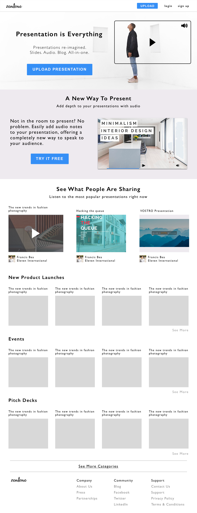
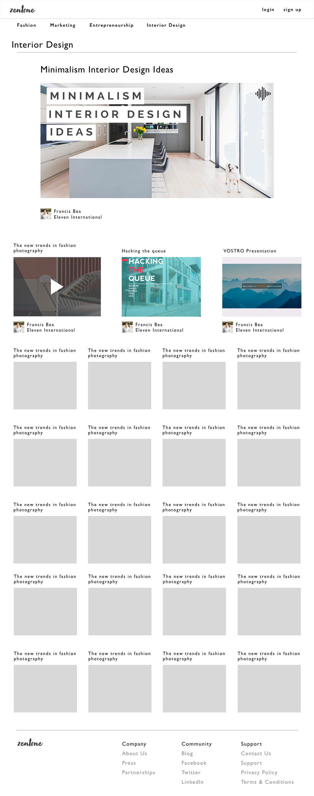
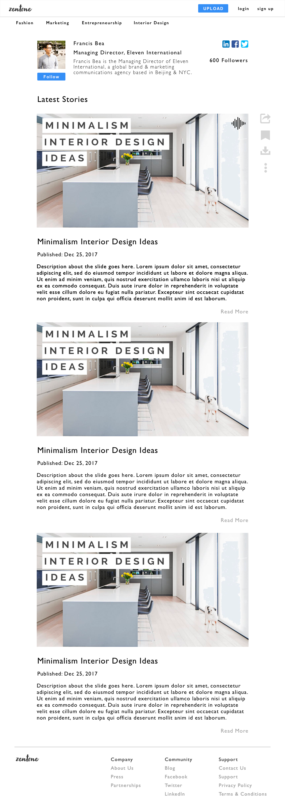
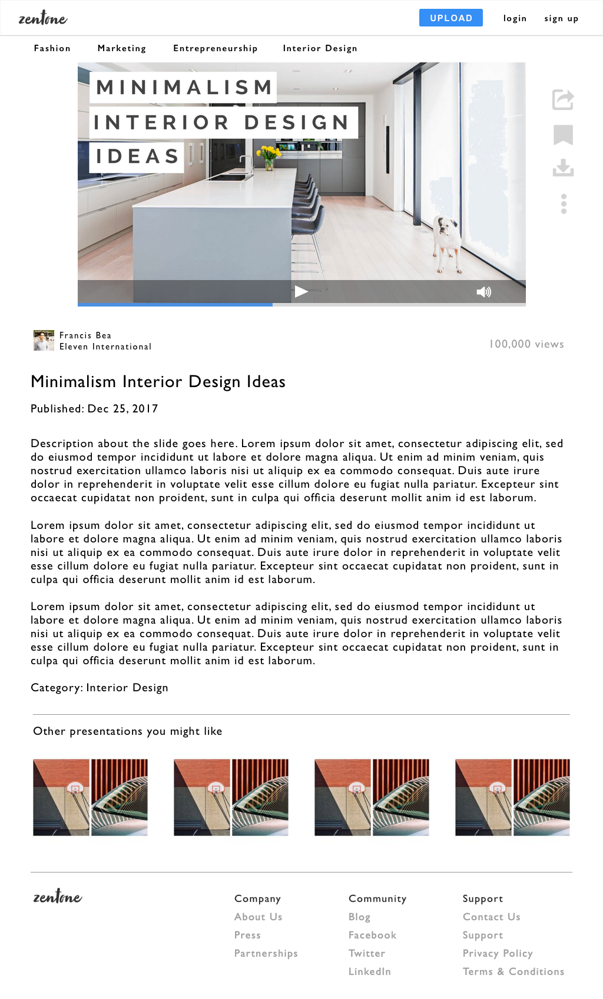
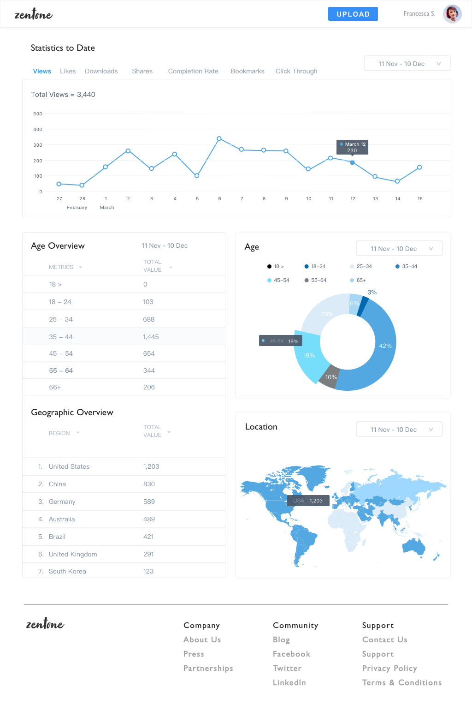
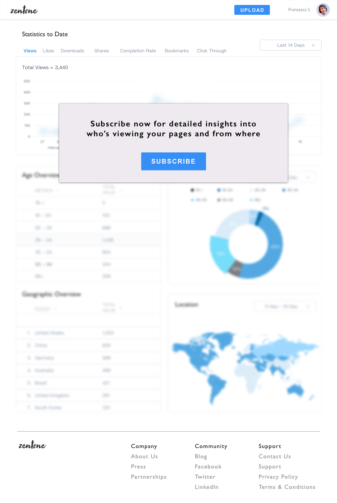
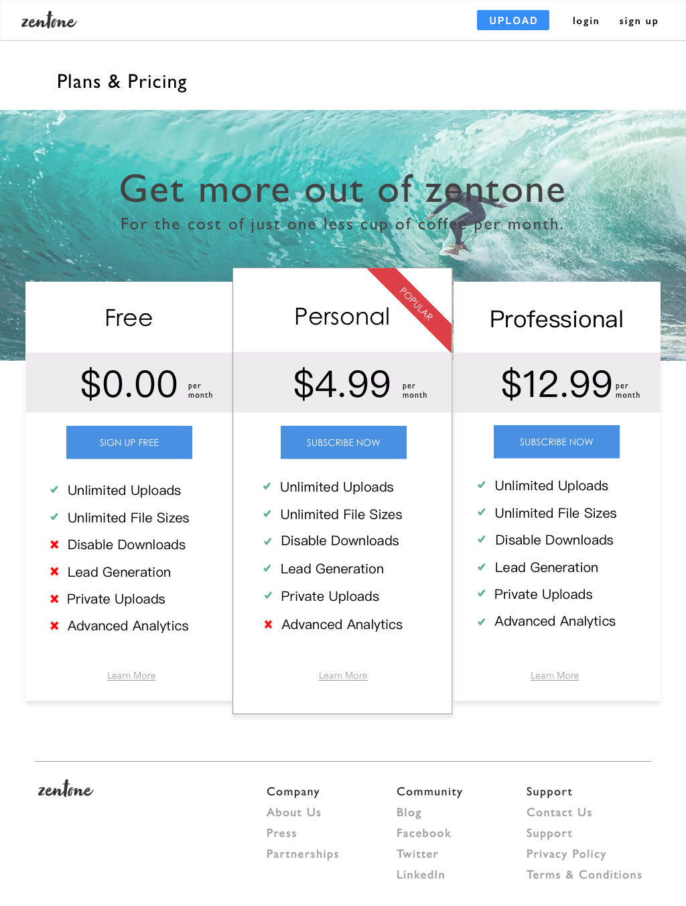
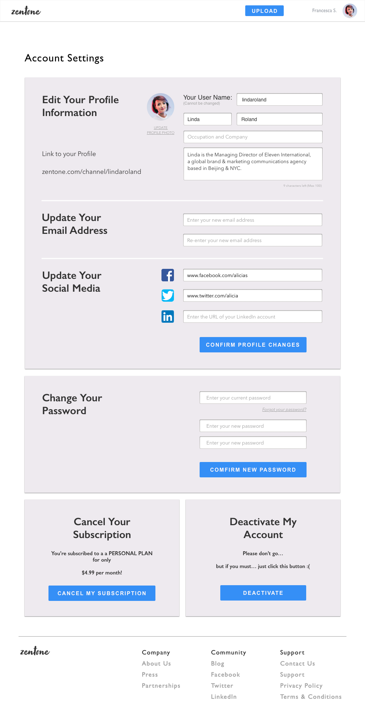

# Zentone

## Overview

Share Audio Enhanced Presentations

## Scope
#### Front End:
  - Handlebars.js
  - Bootstrap
  - CSS Grid
  - SCSS Precompiler
  - jQuery
#### Back End:
  - Node.js
  - Express.js
  - Sequelize ORM
  - PostgreSQL
  - Webpack
#### Libraries:
  - PDF.js
#### Hosting:
  - Aliyun OSS
  - Heroku
#### OAuth 2.0:
  - LinkedIn
  - Facebook
  - Twitter

## To Do
#### Front End
  - [ ] Presentations Views, Share, Bookmark, Download
  - [ ] Collapse Blog on User Presentations Page
  - [ ] Stop / Start Audio Button
  - [ ] Audio Progress Bar
  - [ ] User Birthday Entry
  - [ ] Home Page
  - [ ] Expand Slide View
  - [ ] Categories Nav Options
  - [ ] Categories Page
  - [ ] Bookmarks Page
  - [ ] 1 Featured Presentation Partial
  - [ ] 3 Followers' Presentations Partial
  - [ ] 3 Trending Presentations Partial
  - [ ] 4 x 5 Lazy Load Presentations Grid
  - [ ] Plans & Pricing Page
  - [ ] Payment Page
  - [ ] Statistics Page
  - [ ] Line Graph (Views / Time)
  - [ ] Age Overview Donut Chart (Views + Age)
  - [ ] Location Map (Views + Location)
  - [ ] Admin Featured Editor
  - [ ] Footer Pages

#### Back End
  - [x] isAdmin User Boolean
  - [x] Personal Premium Users Boolean
  - [x] Professional Premium Users Boolean
  - [x] Views data collection
  - [x] Followers count
  - [x] Following array
  - [x] Bookmarks array
  - [ ] Views, Shares, and Bookmarking  Routes
  - [ ] Save OAuth tokens to session
  - [ ] Payments Controller (Paypal?)
  - [ ] Mailing Service 

#### Security & Authentication
  - [ ] LinkedIn OAuth strategy
  - [ ] Facebook OAuth strategy
  - [ ] Twitter OAuth strategy
  - [ ] User cookies and site tokens
  - [ ] CORS protection
  - [ ] Set secure cookies

#### Production & Hosting
  - [ ] Buy Web Service Plan
  - [ ] Migrate site to custom domain
  - [ ] Give keys and access to owner
  - [ ] Admin Tools for Custom Featured Presentation

### Bugs
- [x] Canvas width overflow
- [ ] Delayed & stacking message flashing

### Optimize && Refactor
- [ ] Lazy Load Presentations Grid
- [ ] Account Settings Styles
- [ ] Organize css into scss pages
- [ ] Remove unnecessary scripts
- [ ] Single PDF parser js function
- [ ] Migrate from jQuery to vanilla js
- [ ] Lazy load thumbnail slider
- [ ] Handlebars.js precompile elements on server
- [ ] Eliminate Bootstrap
- [ ] Tag Sizing
- [ ] Link on Home

## Pages Overview

#### Home

* Two Hero Headers
* Three Featured Presentations (sort by views / recent)
* Three Rows of Popular Categories (sort by views / recent)

#### Categories

* Admin-Controlled Featured Presentation
* Three Featured Presentations (sort by category / views / recent)
* 4 x 5 Grid Presentations (sort by category / recent)

#### User Presentations

* User Display with Social Links and Follow
* Uploaded Presentations (sort by user / recent)

#### Slide Viewer

* Main Display with Audio Player and Social Buttons
* Blog
* Tags
* Four Presentations (sort by category / recent)

#### Slide Editor
.png)
* Display PDF and Thumbnail Slider
* Upload Audio per Page
* Write Blog Form Fields

#### Analytics (Premium)

* Line Graph (Views, Bookmarks, Downloads, Shares, Completion / time)
* Donut Chart (age / views)
* Map (location / views)

#### Analytics (!Premium)

* Link to Pricing Page
* Fake Data

#### Pricing

* Three Plans

#### Settings
